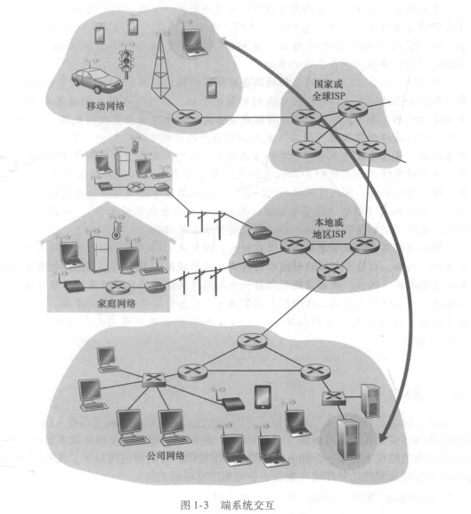

# 一 计算机网络和因特网

## 摘要

从整体上粗线条地勾勒出计算机网络的概貌。

- 通信链路：communication link
- 分组交换机：packet switch
- 传输速率：transmission rate
- 路由器：router
- 链路层交换机：link-layer switch
- 因特网服务提供商：Internet Service Provider, ISP
- 传输控制协议：Transmission Control Protocol, TCP
- 网际协议：Internet Protocol, IP
- 请求评论：Request For Comment, RFC
- 分布式应用程序：distributed application
- 套接字接口：socket interface
- 数字用户线：Digital Subscriber Line, DSL
- 电缆因特网接入：cable Internet access
- 光纤到户：Fiber To The Home, FTTH
- 混合光纤同轴：Hybrid Fiber Coax, HFC
- 存储转发传输：store-and-forward transmission
- 电路交换：circuit switching
- 频分复用：Frequency-Division Multiplexing, FDM
- 时分复用：Time-Division Multiplexing, TDM
- 存在点：Point of Presence, PoP
- 因特网交换点：Internet Exchange Point, IXP
- 内容提供商网络：content provider network
- 节点处理时延：nodal processing delay
- 排队时延：queuing delay
- 传输时延：transmission delay
- 传播时延：propagation delay
- bps: bit per second
- 拒绝服务攻击：Denial-of-Service(DOS) attack

## 1.1 什么是因特网

**其一** 我们能够描述因特网的具体构成，即构成因特网的基本硬件和软件组件。

分组：当一台端系统要向另一台端系统发送数据时，发送端系统将数据分段，并为每段加上首部字节，由此形成的信息包称为分组。

两组最著名的分组交换机的类型是 路由器 和 链路层交换机。

**其二** 我们能够根据为分布式应用提供服务的联网基础设施来描述因特网。

涉及多个相互交换数据的端系统的应用程序称为分布式应用程序。

**协议（protocol）** 定义了在两个或多个通信实体之间交换的格式和顺序，以及报文发送和/或接收一条报文或其他事件所采取的动作。

## 1.2 网络边缘

通常把与因特网相连的计算机和其他设备称为端系统，因为它们位于因特网的边缘。

主机（或端系统）可以进一步划分为两类：客户（client）和服务器（server）。

### 1.2.1 接入网

## 1.3 网络核心

网络核心是由互联因特网端系统的分组交换机和链路构成的网状结构。

### 1.3.1 分组交换

端系统彼此交换报文（message）。为了从源端系统向目的端系统发送报文，源将长报文划分为较小的数据块，称为分组。在源和目的地之间，每个分组都通过通信链路和分组交换机传送。

### 1.3.2 电路交换

在电路交换网络中，在端系统间通信会话期间，预留了端系统间沿路径通信所需要的资源（缓存、链路传输速率）。

### 1.3.3 网络的网络

接入 ISP 自身必须互联，即创建网络的网络。

今天的因特网是一个网络的网络，其结构复杂，由十多个第一层 ISP 和数十万个较低层 ISP 组成。较低层的 ISP 与较高层的 ISP 相连，较高层 ISP 彼此互联。用户和内容提供商是较低层 ISP 的客户，较低层 ISP 是较高层 ISP 的客户。

## 1.4 分组交换网中的时延、丢包和吞吐量

## 1.5 协议层次及其服务模型

为了给网络协议的设计提供一个结构，网络设计者以分层（layer）的方式组织协议以及实现这些协议的网络硬件和软件。

协议分层具有概念化和结构化的优点。

各层的所有协议被称为协议栈，因特网的协议栈由 5 个层次组成：物理层、链路层、网络层、运输层和应用层。

- 应用层：HTTP、SMTP、FTP、DNS
- 运输层：TCP/UDP
- 网络层：IP
- 链路层：以太网、WIFI、电缆接入网的 DOCSIS 协议
- 物理层：物理协议

OSI 模型在应用层下增加了 表示层 和 会话层。

## 1.6 面对攻击的网络

多数恶意软件是自我复制的。

## 课后习题和问题

### R1

所有与因特网连接的设备称为主机或者端系统。主机和端系统并没有不同，常见的端系统包括服务器、桌面 PC、智能手机、平板电脑等，Web 服务器是一种端系统。

### R2

百度百科： 国家之间或政府之间缔结的据以确定其相互权利和义务的协议文书，多用于重大的政治、经济、军事、法律等问题的协议。有双边的，也有多边的。狭义仅指以条约命名的协议，如同盟条约、友好条约、和平条约、互不侵犯条约等。广义指不论以何种名称或形式缔结的协议，如条约、公约、协定、联合宣言、联合公报、联合声明、议定书、会谈纪要、换文、合同等。条约、公约等属于国际法律文件,是最重要的外交文书。其缔结和生效程序很严格，需经国家宪法规定的机关批准，完成其法律手续。一般由缔约国各方派代表经正式谈判达成原则协议后,共同拟订条文;次经缔约方国家元首批准,再按商定日期和地点举行换文仪式,交换批准书。通常规定双方缔结的条约，自互换批准书之日起开始生效。条约或公约经签订后，在其有效期内对各缔约国均具有约束力。协定用于缔结意义不十分重大或短期性的协议，其应用较广泛，如贸易协定、海运协定等。议定书通常用于某些具体问题的协议，或用于对已经缔结的条约进行解释、补充、修改或延长其有效期等。协定和议定书的有效期较短，缔结手续也比较简单。换文指双方用互换照会的形式对达成协议的内容予以确认，有时它是条约、协定等的附件。

### R3

标准定义了协议的具体内容，没有标准，协议就不能交互，因而不能完成有用的工作，为了完成一项工作，要求两个（或多个）通信实体运行相同的协议。

### R4

住宅接入：DSL、电缆、FTTH、拨号和卫星

公司接入：以太网和 WiFi

广域无线接入：3G 和 LTE

### R5

HFC 带宽是用户间共享的。下行 HFC 信道中不会发生碰撞。因为分组是由一个源发出，由不同的端系统接受，不会存在冲突。

### R6

光纤到户，50M 左右。

### R7

100M 到 1G 不等。

### R8

双绞铜线、同轴电缆、光纤等。

### R9

拨号调制解调器：速率 56kbps，带宽专用

HFC：下行速率：42.8Mbps，上行速率：30.7Mbps，带宽共享

DSL：下行速率：24Mbps，上行速率:2.5Mbps，带宽共享

FTTH：平均下行速率：20Mbps，带宽共享

### R10

WiFi 和 4G 接入。 WiFi 速度快但距离短，4G 速度慢但距离远。

### R11

$$\frac{L}{R_1}+\frac{L}{R_2}$$

### R12

在电路交换网络中，在端系统间通信会话期间，预留了端系统间沿路径通信所需要的资源（缓存、链路传输速率）。TDM 相比 FDM 的优点：

- 当发生拥塞等网络问题时，TDM 中的数据丢失可能只会是一部分，而 FDM 中就可能是大部分或全部。
- TDM 适合数字信号传输，而 FDM 适合模拟信号传输，因为现在通信网络多是传输数字信号，所以 TDM 比 FDM 好。
- 因为频分复用连接建立后，当中途没有数据传输时，他所占有的频段带宽不能被其他连接使用，故可能存在空置，而在时分复用的统计时分模式下，连接建立后，当某个连接暂时不用传输数据时可以少分时间片或者不分，即其时隙的分配时“按需分配”，这样就让出了相应的传输时间给其他连接。

### R13

a. 2 个用户

b. 如果两个或更少的用户在传输，即使它们同时传输，也仅仅完全占用了 2Mbps 链路，不会造成排队。如果有 3 个用户同时传输，需要 3Mbps，而此时链路只有 2Mbps，因此将会有排队时延。

c. 20\\%

d. 同时传输的概率是 0.2\*0.2\*0.2=0.008。因为只有三个用户时，队列才会增长，所以队列增长的时间比率为 0.008。

### R14

等级结构相同级别的两个 ISP 之间是彼此互联的。

IXP 可以通过交换的流量对 ISP 收费。

### R15

谷歌专用网络与较低层 ISP 对等，“绕过”因特网的较高层，不仅能够减少向顶层 ISP 支付的费用，而且对其服务最终如何交付给端用户有了更多的控制。

### R16

节点处理时延、排队时延、传输时延和传播时延。

固定：节点处理时延、传输时延、传播时延

变化：排队时延

### R17

### R18

传输时延：$1kb/2Mbps = 1*10^3*8 bit/2*10^6 bps = 4ms$

传播时延：$2500km/2.5*10^8m/s=10ms$

总时间：14ms

更为一般的：

传输时延：8\*L/R

传播时延：d/s

总时间：8\*L/R+d/s

时延与传输速率相关

### R19

吞吐量指每秒能够传送的数据量。

a. 吞吐量为 500kb.
b. $4MB/500kbps=4*10^6*8 bit / 500*10^3 bps = 64s$
c. 100kbps, 320s

### R20

端系统利用应用层生成分组。

此时的分组交换机指的是路由器，路由器使用分组中的 IP 地址来决定将该分组转发到哪一个链路。

每个路由器都有一个转发表，当某分组到达一台路由器时，路由器检查 IP 地址，并用这个地址搜索转发表，以发现适当的输出链路。这种方式与沿途询问方向类似。

### R21

### R22

比如运输层，TCP 的任务有划分为短报文，拥塞控制，流量控制，可靠性等等。它的任务不是由两个（或更多）层次执行的。但是，很多层次的任务是互相重复的。

### R23

- 应用层：网络应用程序及它们的应用层协议存留的地方。
- 运输层：在应用程序端点之间传送应用层报文。
- 网络层：负责将数据报（datagram）的网络层分组从一台主机移动到另一台主机。
- 链路层：将分组层从一个节点（主机或者路由器）移动到路径上的下一个节点。
- 物理层：将链路层分组（帧，frame）中的一个个比特从一个节点移动到下一个节点。

### R24

应用层报文：一个端系统中的应用程序使用协议与另一个端系统中的应用程序交换信息分组，这种位于应用层的信息分组称为报文（message）。

- 运输层报文段：运输层的分组
- 网络层数据报：网络层的分组
- 链路层帧：链路层的分组

### R25

路由器处理的层次：物理层、链路层、网络层

链路层交换机处理的层次：链路层、物理层

主机处理的层次：物理层、链路层、网络层、运输层、应用层

### R26

病毒是一种需要某种形式的用户交互来感染用户设备的恶意软件。蠕虫是一种无须任何明显用户交互就能进入设备的恶意软件。

### R27

恶意软件控制了很多网络设备，统称为僵尸网络。

利用恶意软件，僵尸网络中的网络设备向目标主机发送大量的分组，或者创建大量连接等等，使目标主机陷入困境。这就是僵尸网络被用于 DDoS 攻击的效果。

### R28

Trudy 能够将有害程序投放到 Alice 和 Bob 的计算机中，能够使用分组嗅探器获得传输分组的副本，能够通过 IP 哄骗将具有虚假源地址的分组注入因特网。

## Wireshark 实验

1.  HTTP, TCP, DNS
2.  0.393960461s
3.  192.168.1.115, 128.119.245.12
4.  如 [PDF](./Get_Ok.pdf) 所示。
